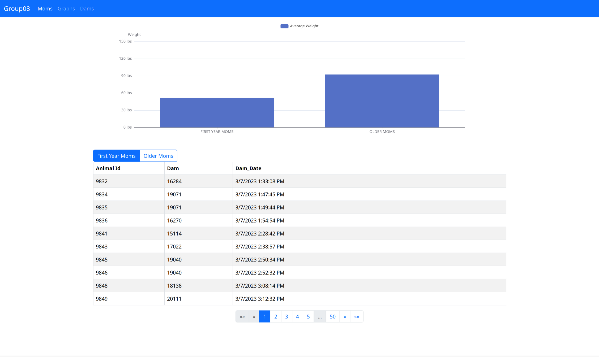
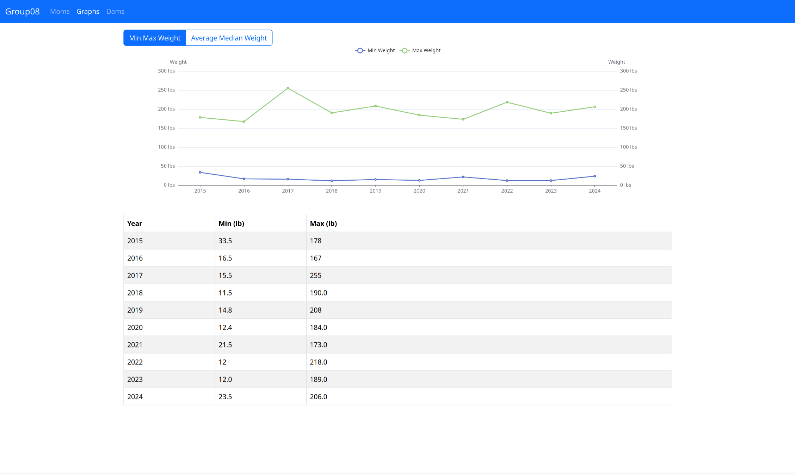
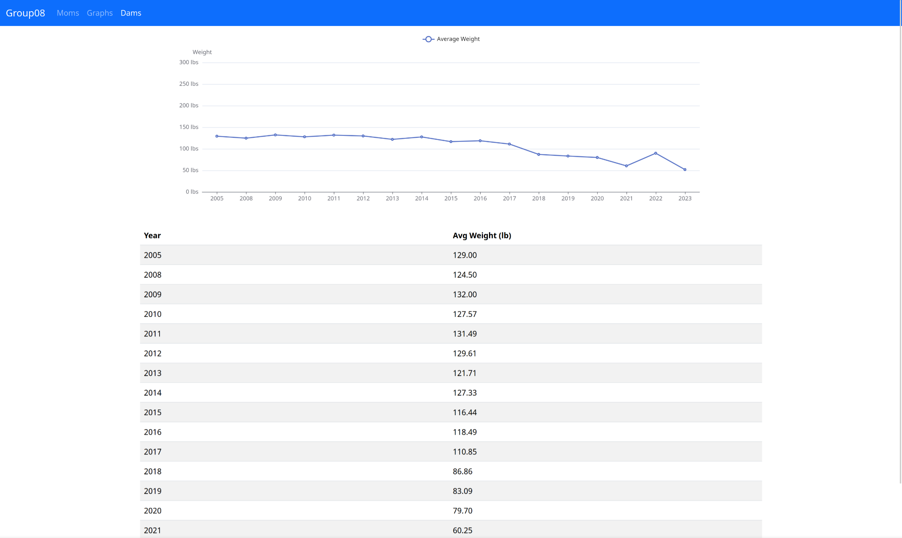

# CSC315 Project - Group 08
Noah Springer, Freddy Avila Cruz, Michael Oflazian
### Install and Dependencies
1. Install Node.js and npm:
  Arch: `pacman -S nodejs npm`
2. Run `init.sh` to setup the database and install dependencies
### Running
1. Run `start_api.sh` to run the Postgres API.
2. Run `start_web.sh` to run the local webserver.
3. The website should have opened in your default browser, if not, navigate to `localhost:4200`.

### Code
- Noah is responsible for the web and API code, questions about it can be directed towards him.
- API was built using Express.js and documentation was created with Swagger and can be accessed at `localhost:3000/api-docs` while the API is running.

### GUI

